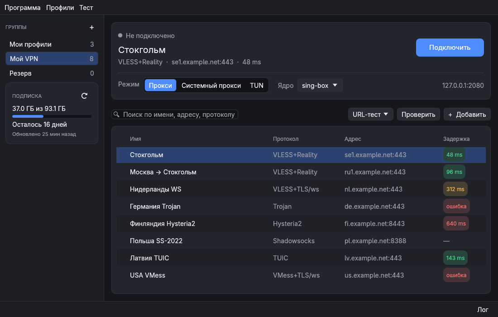
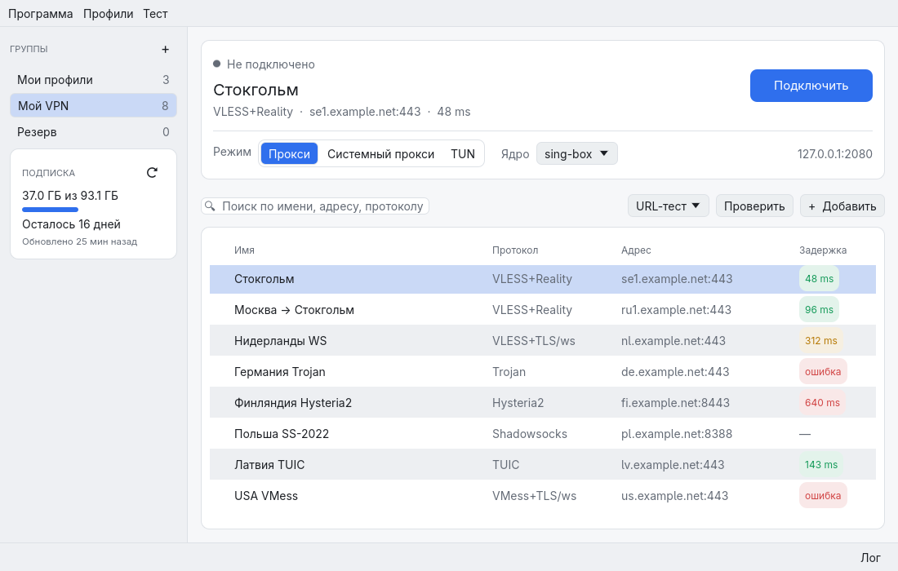
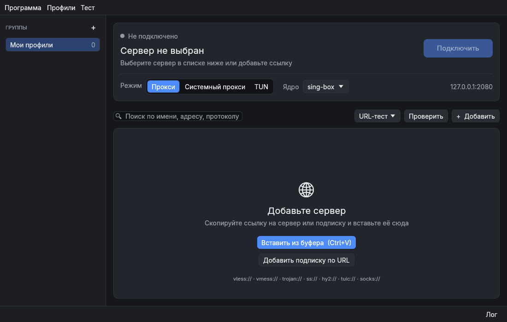
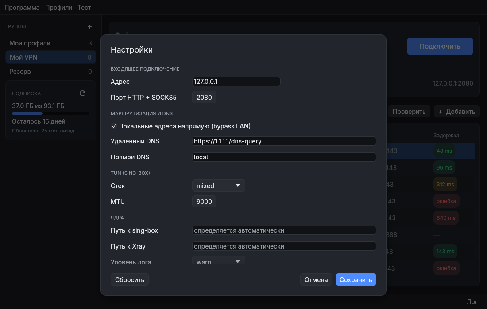

# RustBox

Десктопный прокси/VPN-клиент на Rust: подписки, VLESS/Reality,
Hysteria2, TUIC и другие протоколы, ядра **sing-box** и **Xray**, режимы прокси,
системного прокси и TUN.

Основная платформа — **Linux** (проверено на Arch). Поддержка **Windows** написана,
но на реальной системе пока не проверялась, подробнее [ниже](#windows).



## Возможности

- Ссылки: `vless://` (Reality, Vision, gRPC, WS, XHTTP), `vmess://`, `trojan://`,
  `ss://`, `hysteria2://`, `tuic://`, `socks://`.
- Подписки в любых распространённых форматах, включая полные конфиги Xray (о них ниже).
  Клиент показывает расход трафика и срок действия подписки.
- Два ядра: sing-box и Xray. Если выбранное ядро не поддерживает сервер, клиент сам переключится на другое.
- Проверка серверов: URL-тест отправляет настоящий запрос через сервер, TCP ping только проверяет, открыт ли порт.
- Тёмная и светлая тема, версия для командной строки.

Режимы работы:

| Режим | Что идёт через VPN |
|---|---|
| **Прокси** | только программы, настроенные на `127.0.0.1:2080` |
| **Системный прокси** | браузеры и большинство программ, без дополнительной настройки |
| **TUN** | весь трафик, включая игры и программы, которые не поддерживают прокси |

### Скриншоты

| Светлая тема | Первый запуск | Настройки |
|---|---|---|
|  |  |  |

### Подписки с полными конфигами Xray

Многие VPN-сервисы отдают некоторым клиентам не отдельные ссылки, а готовые конфиги Xray. «Авто»-сервер
в таком конфиге — это сразу несколько серверов, из которых Xray сам выбирает рабочий. Остальные клиенты
получают вместо этого одну ссылку, и часто это запасной сервер, который не отвечает. Поэтому в одном
клиенте сервер работает, а в другом — нет.

RustBox запрашивает полные конфиги и запускает их целиком, поэтому «Авто»-серверы работают как задумано.
Кроме того, клиент исправляет частую ошибку в этих конфигах: DNS-запросы уходят на неработающий сервер,
и обычные сайты открываются по 10 секунд. Если сервис вернёт ответ, который клиент не понимает,
он загрузит обычные ссылки.

## Установка

### Linux (Arch)

Установите ядра:

```sh
sudo pacman -S sing-box xray v2ray-geoip v2ray-domain-list-community
```

Скачайте архив из [Releases](../../releases), распакуйте и запустите `rustbox`.
Можно также собрать клиент самостоятельно (см. [Сборка](#сборка)).

Готовая сборка сделана на Arch и требует glibc 2.44 или новее. На Ubuntu и Debian её лучше собрать из исходников.

Для режима TUN sing-box нужно право создавать сетевой интерфейс. Клиент предложит выдать его сам
(попросит пароль). Можно сделать это и вручную:

```sh
sudo setcap cap_net_admin,cap_net_bind_service=+ep /usr/bin/sing-box
```

Системный прокси настраивается в GNOME и KDE.

### Windows

Сборка для Windows будет в архиве `RustBox-windows.zip`. В нём уже есть всё необходимое: клиент,
ядра и базы geoip/geosite. Устанавливать ничего не нужно, достаточно распаковать и запустить `rustbox.exe`.

- Программа не подписана, поэтому Windows может показать предупреждение. Нажмите «Подробнее» → «Выполнить в любом случае».
- Для режима TUN запустите клиент от имени администратора (правый клик по `rustbox.exe`).
- При выключении системного прокси клиент возвращает прежние настройки.

> На реальной Windows это пока не проверялось. Если что-то не работает, создайте issue
> и приложите лог (кнопка «Лог» внизу окна).

## Как пользоваться

1. Скопируйте ссылку на подписку или сервер.
2. В клиенте нажмите **Ctrl+V** или «+ Добавить» → «Добавить подписку…».
3. Выберите сервер. Кнопка «Проверить» покажет, какие серверы работают.
4. Выберите режим и нажмите **«Подключить»**. Также можно дважды щёлкнуть по серверу или нажать Enter.

Горячие клавиши: Ctrl+V — вставить, Enter — подключиться, Del — удалить, Ctrl+A — выделить всё.

## Командная строка

```sh
rustbox-cli import 'vless://…' 'ss://…'      # ссылки, файл или "-" для stdin
rustbox-cli sub add "Мой VPN" https://…/sub   # добавить подписку
rustbox-cli sub update                         # обновить подписки
rustbox-cli list                               # список серверов
rustbox-cli core xray                          # выбрать ядро
rustbox-cli ping --url                         # проверить серверы
rustbox-cli run 5 --system-proxy               # подключиться (Ctrl+C — отключиться)
rustbox-cli config 5                           # показать конфиг, который получит ядро
```

## Где хранятся данные

| | Linux | Windows |
|---|---|---|
| Настройки | `~/.config/rustbox/settings.json` | `%APPDATA%\rustbox\settings.json` |
| Серверы и подписки | `~/.local/share/rustbox/profiles.json` | `%APPDATA%\rustbox\profiles.json` |
| Временные конфиги ядер | `$XDG_RUNTIME_DIR/rustbox/` | `%TEMP%\rustbox\` |

## Сборка

Нужен Rust 1.85 или новее.

```sh
cargo build --release
./target/release/rustbox          # графический клиент
./target/release/rustbox-cli --help
```

Сборка для Windows из Linux (результат — `dist/RustBox-windows.zip` вместе с ядрами):

```sh
sudo pacman -S mingw-w64-gcc
scripts/package-windows.sh
```

## Устройство кода

```
crates/
  platform/  всё, что зависит от операционной системы
             ├─ linux.rs        прокси в GNOME/KDE, права для TUN, поиск ядер
             ├─ windows.rs      прокси через реестр, TUN от администратора
             └─ unsupported.rs  заглушка для остальных систем
  core/      основная логика, не зависит от системы и интерфейса
             ├─ model.rs        серверы, протоколы, группы
             ├─ link/           разбор и создание ссылок
             ├─ subscription.rs загрузка подписок
             ├─ xray_json.rs    полные конфиги Xray из подписок
             ├─ config/         конфиги для sing-box и Xray
             ├─ process.rs      запуск и остановка ядер
             ├─ latency.rs      проверка серверов
             ├─ connection.rs   подключение
             └─ storage.rs, settings.rs, tls_pin.rs
  cli/       rustbox-cli
  gui/       интерфейс на egui: app.rs — состояние, view.rs — главное окно,
             dialogs.rs — диалоги, theme.rs — оформление, tasks.rs — фоновые задачи
```

Поддержка новой системы добавляется модулем в `crates/platform`, нового ядра — в `core/src/config/`.
Остальной код при этом менять не нужно.

## Тесты

```sh
cargo test --workspace
scripts/screenshots.sh        # скриншоты окна без экрана → target/screenshots/
```

Если sing-box и Xray установлены, тесты также проверяют сгенерированные конфиги самими ядрами.

## Планы

- Проверить Windows и добавить кнопку перезапуска от имени администратора для TUN
- Значок в трее, автозапуск, автообновление подписок
- Правила: что направлять через VPN, а что напрямую
- Статистика скорости и трафика
- macOS

## Лицензия

GPL-3.0-or-later. Шрифт Adwaita Sans (основан на Inter) распространяется под лицензией SIL OFL 1.1
и лежит в `crates/gui/assets/fonts/`.
